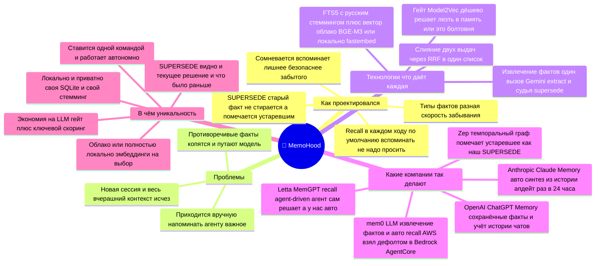

# Mind-map: MemoHood

Как проектировался плагин, какие проблемы решает, на чём построен, **какие компании идут тем же путём**
и в чём отличие. Рендерится прямо на GitHub (mermaid). Презентационная версия той же карты — в Excalidraw
(исходник для видео и соцсетей): [`docs/MINDMAPS.excalidraw`](MINDMAPS.excalidraw) — открыть на
[excalidraw.com](https://excalidraw.com) (File → Open), оттуда экспорт в PNG/SVG. Рисованный
«карандашный» стиль. Под блоком карточек — полоса **«🛠 Что даёт каждая технология и как её поставить»**
(роль + команда установки, см. таблицу ниже), а ещё ниже — стикер «Как питчить за 30 секунд»
(проблема → решение → как → отстройка → крючок).

## 🧠 MemoHood — память диалога

**🛠 Стек и установка MemoHood** — `install.sh` / `install.ps1` одной командой ставят все зависимости,
копируют плагин в `<HERMES_HOME>/plugins/memohood/` и включают провайдер памяти
(`memory.provider: memohood`) в `config.yaml` — руками ничего донастраивать не нужно:

| Технология | Что даёт | Как поставить |
|---|---|---|
| **SQLite FTS5 + RU-стемминг** | полнотекст с морфологией по фактам | в stdlib Python — ставить не надо |
| **sqlite-vec** | вектор для `captures_vec` | ставит `install.sh` / `install.ps1` |
| **PyStemmer** | русская морфология в поиске фактов | ставит `install.sh` / `install.ps1` |
| **Cloudflare BGE-M3 / fastembed** | эмбеддинги: облако или локально | ключи `CLOUDFLARE_*` в `.env` (мастер `hermes memohood setup`), или локальный режим |
| **RRF-слияние** | сливает FTS+вектор в один список | свой код (`retrieve.py`) — зависимостей нет |
| **Cohere Rerank** | реранк топа фактов по релевантности | ключ `COHERE_API_KEY` в `.env` (опц.; иначе rrf-only) |
| **Model2Vec** (гейт) | дёшево решает «лезть ли в память» | ставит `install.sh`/`install.ps1`; включить `gate.backend: model2vec` (модель `potion-base-8M`) |
| **Gemini** | извлечение фактов + судья supersede/duplicate | ключ `GEMINI_API_KEY` в `.env` |

> Цвет-код презентационной карты: как проектировался · проблемы · технологии · какие компании так делают · уникальность.
> Источники по компаниям (проверено): mem0 (+ дефолт в AWS Bedrock AgentCore), Zep/Graphiti (temporal graph),
> Letta/MemGPT, OpenAI ChatGPT Memory, Anthropic Claude Memory.
